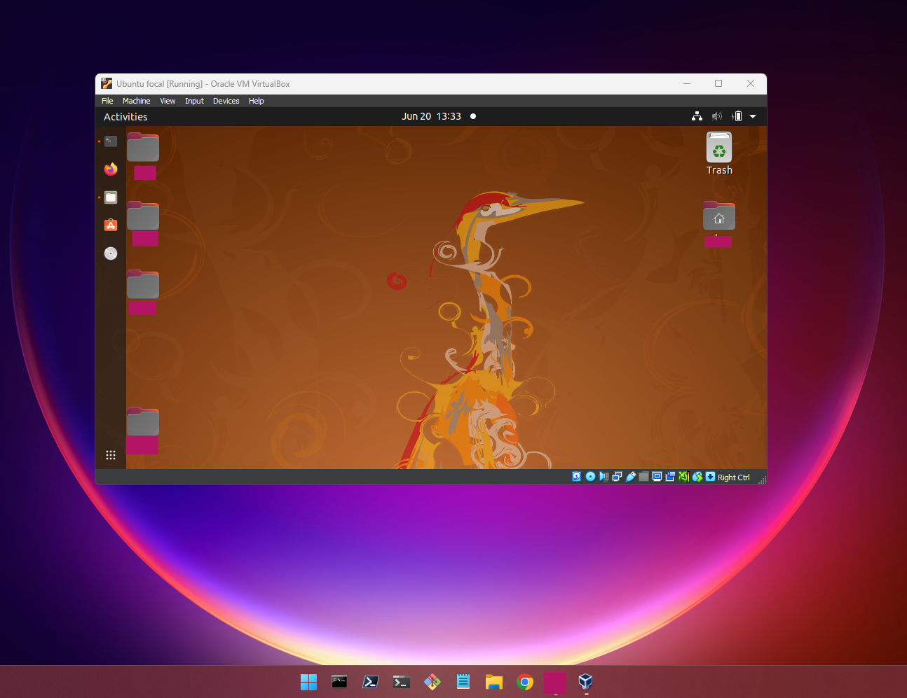
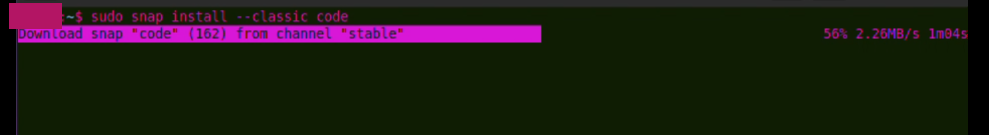
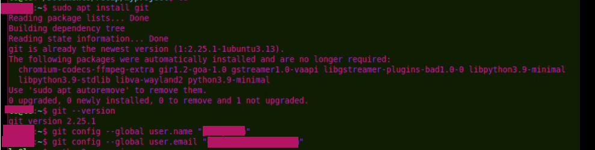
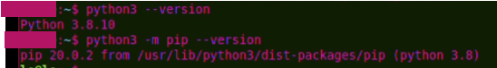
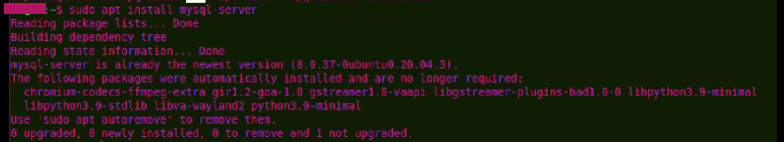

# Developer Environment Setup

## Virtual Machine Setup
- **Virtualization Software:** VirtualBox
- **OS:** Ubuntu 20.04
  - Downloaded the Ubuntu 20.04 ISO from [Ubuntu website](https://ubuntu.com/download/desktop)
  - Installed VirtualBox
  - Created a new virtual machine in VirtualBox
  - Configured virtual machine settings (e.g., memory, storage)
  - Installed Ubuntu 20.04 on the virtual machine
  - 

## Text Editor/IDE
- **Installed:** Visual Studio Code
  - Installed via Snap: `sudo snap install --classic code`
  - 

## Version Control System
- **Installed:** Git
  - Installed via APT: `sudo apt install git`
  - Configured with username and email:
    ```sh
    git config --global user.name "Your Name"
    git config --global user.email "your-email@example.com"
    ```
  - 

## Programming Languages and Runtimes
- **Installed:** Python 3
  - Installed via APT: `sudo apt install python3`
  - Installed pip: `sudo apt install python3-pip`
  - 

## Database
- **Installed:** MySQL
  - Installed via APT: `sudo apt install mysql-server`
  - Secured installation: `sudo mysql_secure_installation`
  - 

## GitHub Account
- Logged into active GitHub account on https://github.com/

## Cloning the Repository
- Cloned the assignment repository
  - 

## Sample Project
- Created a sample project and `.gitignore` file
  - 

## First Commit
- Made the first commit
  - 

## Extensions and Plugins
- **Installed Extensions for VS Code:**
  - Python
  - GitLens

# Reflection

## Challenges Faced
- **Challenge 1: Steep Learning Curve for new linux users**
  - **Description:** One of the challenges encountered during the setup process was dealing with the steep learning curve associated with configuring various tools and technologies. Understanding the nuances of version control systems, setting up a database, and configuring development environments required significant time and effort.
  - **Solution:** To overcome this challenge, I utilized online resources such as documentation, tutorials, and forums to gain a better understanding of the tools and technologies involved. Additionally, I engaged in hands-on practice and experimentation to reinforce my learning and build proficiency gradually.

- **Challenge 2: Compatibility Issues**
  - **Description:** Another challenge was dealing with compatibility issues between different software components. For example, ensuring that the versions of Python, pip, and other dependencies were compatible with each other and with the chosen development tools.
  - **Solution:** To address compatibility issues, I carefully researched and selected software versions that were known to work well together. Additionally, I regularly checked for updates and applied patches to maintain compatibility and resolve any emerging issues.

- **Challenge 3: Configuration Errors**
  - **Description:** Configuration errors, such as misconfigurations in Git or database settings, posed a significant challenge during the setup process. These errors often led to unexpected behavior and hindered progress in setting up the development environment.
  - **Solution:** To mitigate configuration errors, I followed documentation and best practices closely when configuring each tool and technology. I also double-checked my configurations and tested them thoroughly to ensure they functioned as expected. In cases where errors persisted, I sought assistance from online communities and peers to troubleshoot and resolve the issues effectively.

## Additional Notes
- Overall, the setup process was a valuable learning experience that helped me gain a deeper understanding of software development tools and practices. By overcoming various challenges and finding solutions, I feel more confident in my ability to set up and maintain efficient developer environments for future projects.

